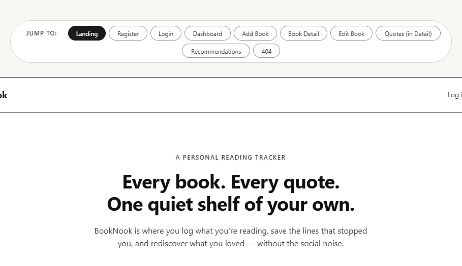
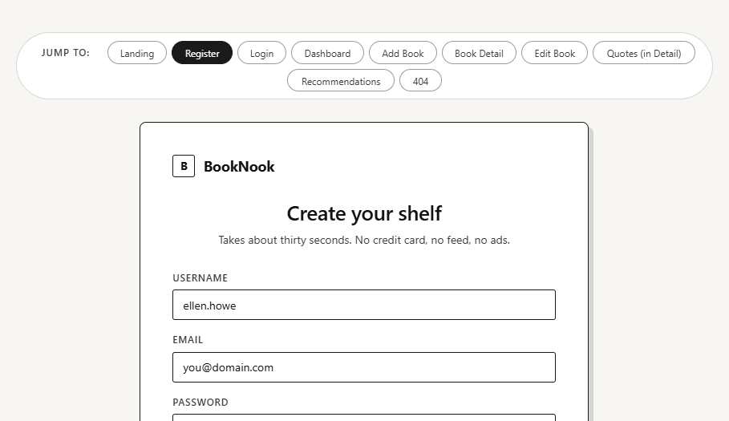
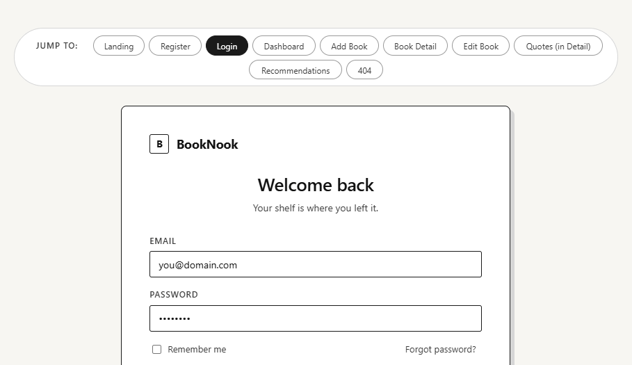
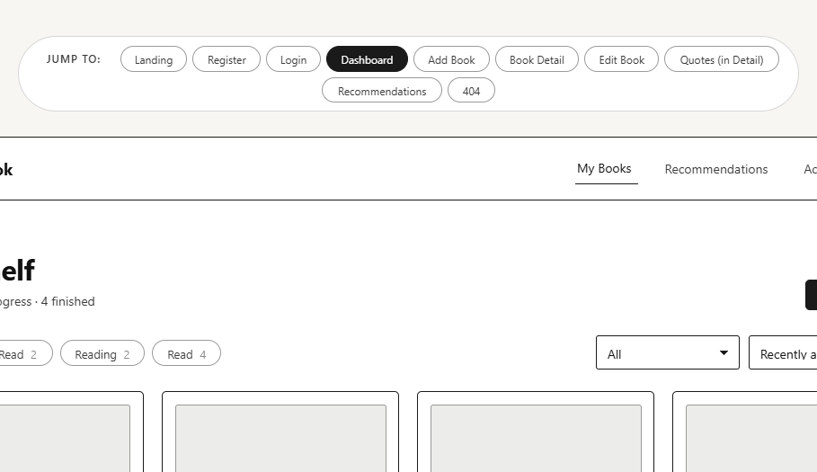
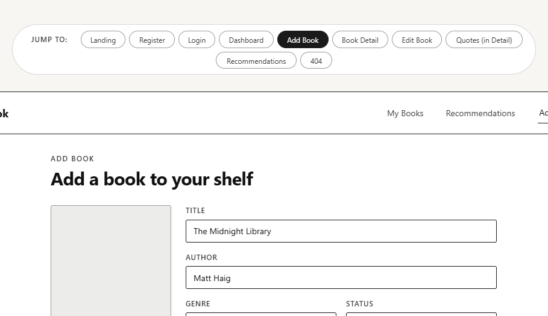
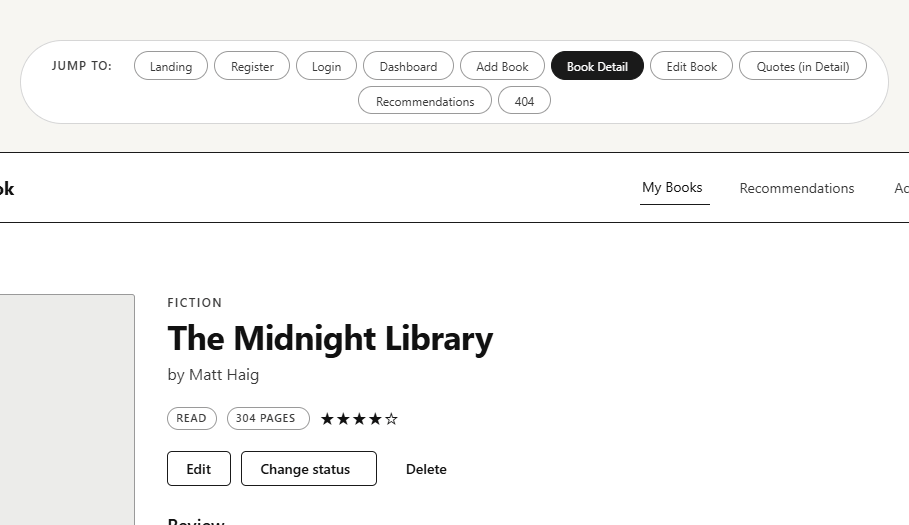
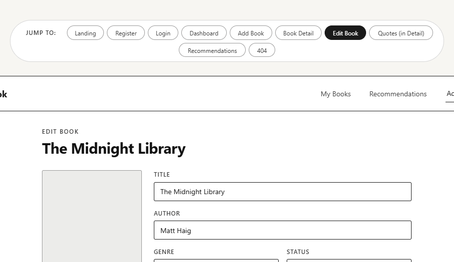
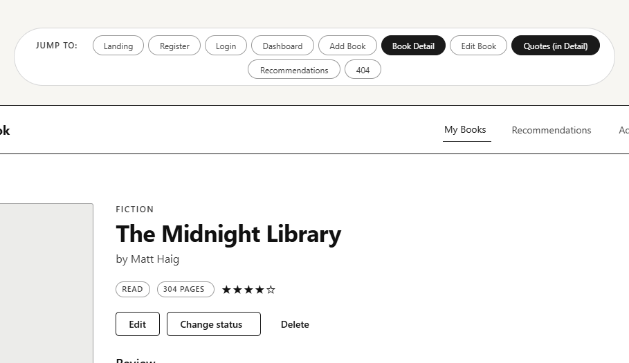
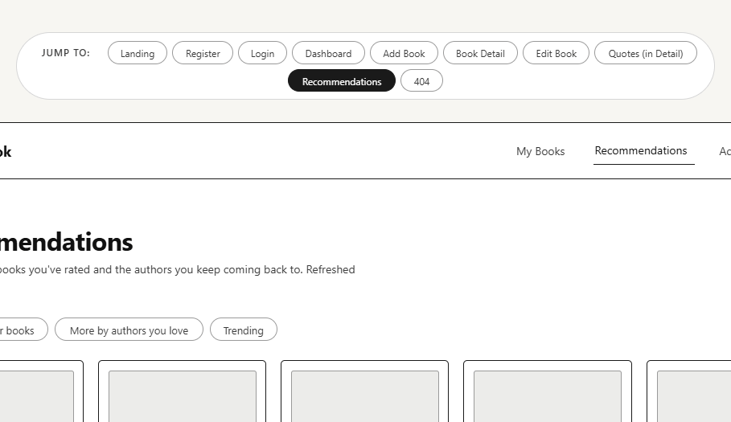
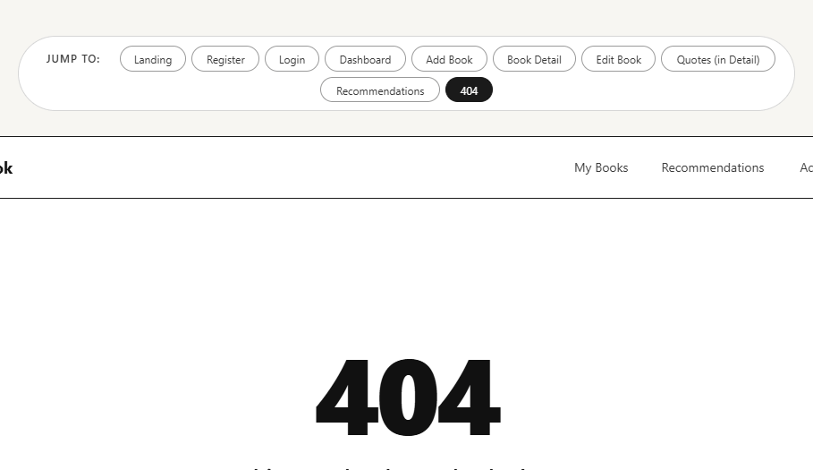

# WIREFRAMES.md

## Screen List

### 1. Landing Page
Intro page explaining the app with buttons to log in or register.

### 2. Register Page
Form for creating a new account with username, email, and password.

### 3. Login Page
Form for existing users to log in.

### 4. Dashboard (My Books)
Displays a list of the user's books with filters for status and genre.

### 5. Add Book Page
Form where users can add a new book with details like title, author, genre, and status.

### 6. Book Detail Page
Shows full information about a book, including rating, review, and associated quotes.

### 7. Edit Book Page
Form to edit an existing book's details.

### 8. Quotes Section (within Book Detail)
Displays all quotes for a specific book and allows adding, editing, or deleting quotes.

### 9. Recommendations Page
Displays recommended books based on the user's highly rated books.

### 10. Not Found Page
Displayed when a user navigates to a route that does not exist.

